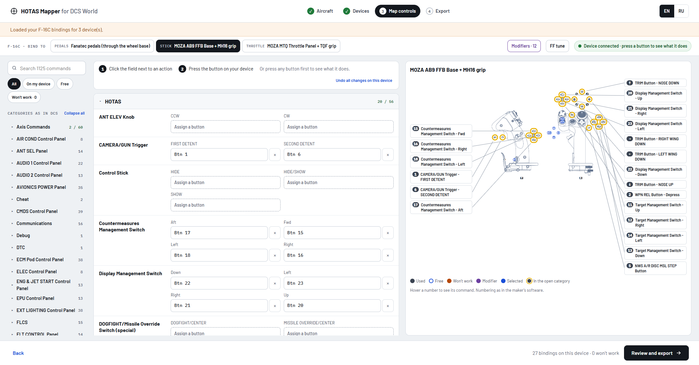
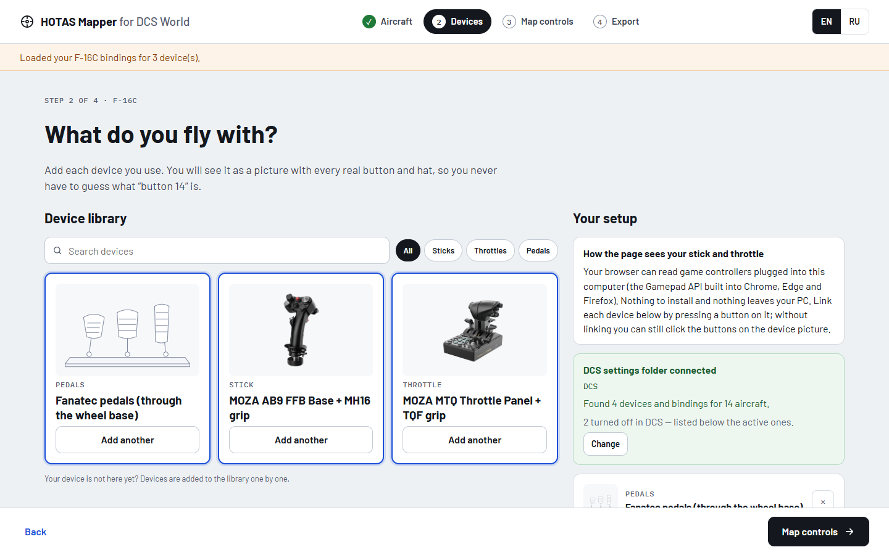
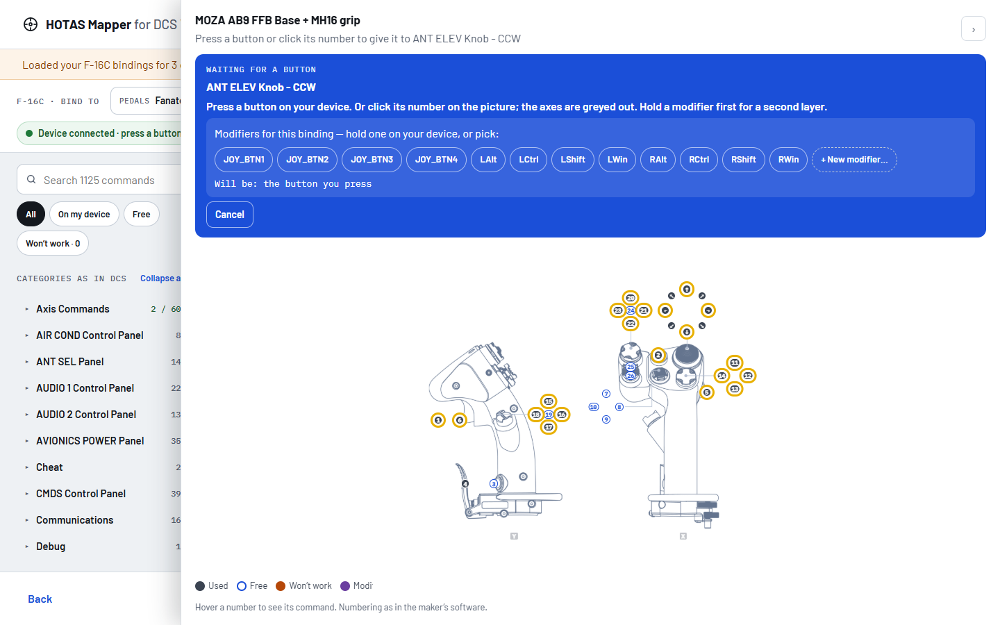
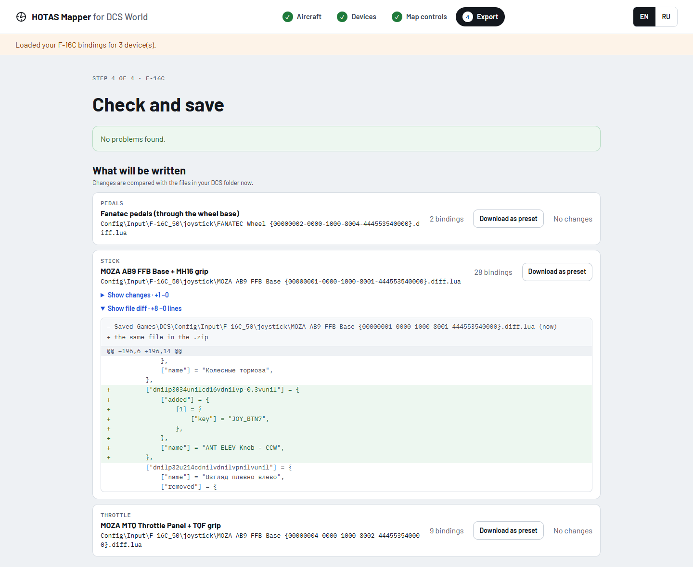
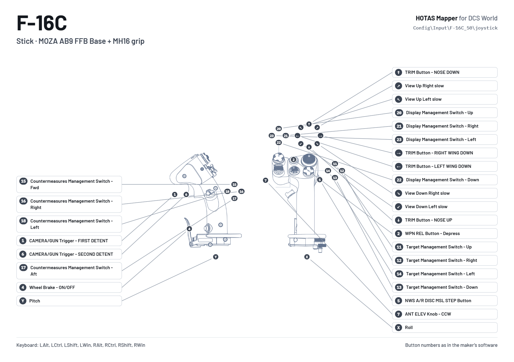

# HOTAS Mapper for DCS World

A static web app that maps DCS World aircraft commands onto a real stick, throttle and pedals,
shown as pictures of the devices with the maker's button numbers, and writes the result as the
`.diff.lua` files DCS reads from `Saved Games\DCS\Config\Input`.

Nothing runs on a server: the page reads the joystick through the browser Gamepad API and reads the
DCS settings folder (read only) in the browser. The result is downloaded as a `.zip` that the user
unzips into `Saved Games\DCS`.



**Open https://com30n.github.io/dcs-mapper/** in Chrome, Edge or Firefox. Nothing to install
and no account: the page works on your own computer, and your settings never leave it.

## How it works

**1. Aircraft.** Pick the aircraft and open your `Saved Games\DCS` folder; the page reads the
bindings you already have.

**2. Devices.** Pick your stick, throttle and pedals from the device library. Each one comes with a
picture of the real device and the maker's button numbers. Press a button on it once and the page
knows which controller is which.



**3. Map controls.** The commands are grouped exactly as on the DCS Controls screen. Click the field
next to a command, then press the button on your device or click it on the picture. The page says
whether it waits for a button or an axis, and warns when a binding will not work in DCS, for example
because the button is also a modifier.



**4. Export.** See what will change in each file, then download a `.zip` to unzip into
`Saved Games\DCS`. Nothing in your folder changes until you do that yourself.



Every device also gets a layout picture to print or keep on a second screen:



## Run your own copy

The image, the Helm chart and the built site of every version are on the
[Releases](https://github.com/com30n/dcs-mapper/releases) page.

### Docker

```
docker run --rm -p 8080:8080 ghcr.io/com30n/dcs-mapper:latest
```

Then open http://localhost:8080.

### Kubernetes

```
helm install hotas oci://ghcr.io/com30n/charts/dcs-mapper --version 1.0.0 --namespace hotas --create-namespace
kubectl --namespace hotas port-forward service/hotas-dcs-mapper 8080:80
```

Then open http://localhost:8080. To serve it on a host name, add an Ingress with
`--set ingress.enabled=true --set ingress.className=nginx --set 'ingress.hosts[0]=hotas.example.com'`,
or a Gateway API route with `httpRoute.enabled`, `httpRoute.parentRefs` and `httpRoute.hostnames`.
The other settings are in [values.yaml](deploy/dcs-mapper/values.yaml).

### Any web server

Download `dcs-mapper-site-<version>.zip` from the
[latest release](https://github.com/com30n/dcs-mapper/releases/latest), unzip it and serve the
folder as static files.

## Development

Needs Node.js 22 and Python 3.13:

```
git clone https://github.com/com30n/dcs-mapper.git
cd dcs-mapper
npm --prefix web ci
python tools/build_site.py
npm --prefix web run dev
```

Then open http://localhost:5173. The page reloads on every change in `web/`; run `build_site.py`
again after changing aircraft, devices or translations. `npm --prefix web test` runs the tests,
`docker compose up --build` builds and runs the image from your checkout.

## Repository layout

- `aircraft/<module>/` — one folder per DCS module: `aircraft.json` (commands with their DCS
  categories, default bindings per device type, ED presets) and `l10n/<language>.json`.
- `devices/<maker>/<device>/` — the device library: `device.json` and the pictures. Buttons are
  placed in percent of each picture; cards and views are windows onto the pictures.
- `locales/<language>.json` — the site's own texts. A new file is a new language.
- `web/` — the app, in React, TypeScript and Vite: `src/dcs` is how DCS reads and writes bindings
  (with tests against DCS's own results), `src/state` the app state and its actions,
  `src/features/<step>` the four screens, `src/ui` the shared pieces, `src/gamepad` the controller
  polling.
- `tools/` — `build_site.py` puts site and data together into `build/` with the lists the site
  loads; `validate.py` checks the data; `extract_aircraft.py` and `extract_moza.py` read DCS and
  MOZA Cockpit.
- `Dockerfile`, `compose.yaml`, `nginx.conf` — the same build behind nginx in a container;
  `deploy/dcs-mapper` — the Helm chart that runs that container in Kubernetes.

Adding aircraft, devices and translations, also without git: see [CONTRIBUTING.md](CONTRIBUTING.md).

## Rebuilding the data

Needs a local DCS World install (and MOZA Cockpit for the MOZA devices) on Windows. It is the same
aircraft tool that every release carries as `hotas-mapper-export-module.exe`:

```
python tools/extract_aircraft.py
python tools/extract_aircraft.py --only FA-18C_hornet
python tools/extract_moza.py
```

`extract_aircraft.py` runs `tools/catalog.lua` under DCS's own `bin/luae.exe`, so profiles are
evaluated exactly as DCS does it.
